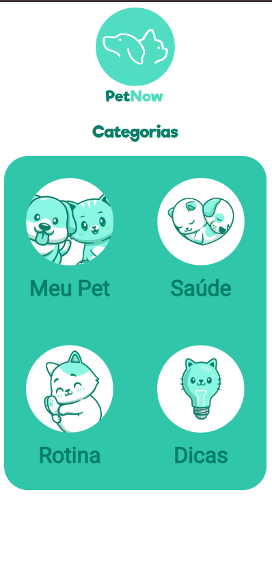

# PetNow 🐾

Aplicação desenvolvida para facilitar o cuidado com animais de estimação. A **PetNow** é uma plataforma simples e amigável, criada usando **Vue.js**, para ajudar usuários a organizarem informações sobre seus pets.



---

## Funcionalidades 🌟

- **Tela Principal**: Apresenta as categorias disponíveis (Meu Pet, Saúde, Rotina, Dicas).
- **Meu Pet**: Atualmente funcional, onde o usuário pode adicionar informações básicas do seu pet.

### Funcionalidades futuras
As demais categorias (Saúde, Rotina, e Dicas) estão em planejamento para futuras atualizações.

---

## Tecnologias Utilizadas 🛠️

- **Frontend**: Vue.js
- **Estilo**: CSS para design responsivo e amigável
- **Iconografia**: Imagens e ícones ilustrativos para uma interface leve e divertida

---

## Pré-requisitos 🧩

- **Node.js** (versão 16 ou superior)
- **Vue CLI** (opcional, mas recomendado para desenvolvimento local)

---

## Como rodar o projeto 🚀

1. Clone o repositório:
   ```bash
   git clone https://github.com/seu-usuario/petnow.git
   cd petnow
   ```

2. Instale as dependências:
   ```bash
   npm install
   ```

3. Inicie o servidor local:
   ```bash
   npm run serve
   ```

4. Acesse no navegador:
   ```
   http://localhost:8080
   ```

---

## Estrutura do Projeto 📂

```
C:.
|   App.vue
|   main.js
|
+---assets
|   |   dicas.png
|   |   gato.png
|   |   gato2.png
|   |   gato3.jpg
|   |   logo.png
|   |   meupet.png
|   |   rotina.png
|   |   saude.png
|   |
|   \---icon
|           alimentacao.png
|           banho.png
|           gps.png
|           passeio.png
|           Union.png
|           Vector.png
|
+---components
|       Agendamentos.vue
|       InformcacaoMeuPet.vue
|       Navegacao.vue
|
+---mock
|       mock.json
|
+---router
|       index.js
|
\---views
        CategoriasView.vue
        MeuPetView.vue
```

---

## Melhorias Futuras 🌱

- [ ] Implementar as telas de Saúde, Rotina e Dicas
- [ ] Adicionar persistência de dados localmente ou via API
- [ ] Criar um sistema de notificações para lembretes
- [ ] Melhorar a navegação entre as categorias

---

## Contribuições 🖐️

Contribuições são bem-vindas! Sinta-se à vontade para enviar um pull request ou abrir uma issue.

---

## Licença 📜

Este projeto está licenciado sob a [MIT License](LICENSE).

---

Se precisar de mais alguma personalização, é só avisar! 😊